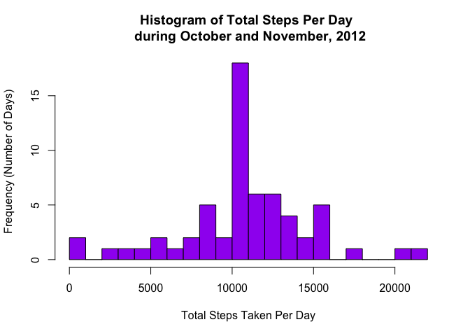

# Reproducible Research: Peer Assessment 1

```r
library(knitr)
```

Set global option so that all code is output.

```r
opts_chunk$set(echo=TRUE)
```

## Loading and preprocessing the data

Read in activity.csv file.

```r
data <- read.csv("./activity.csv")
```


Convert dates in date column to date class

```r
data$date <- as.Date(data$date)
```

## What is mean total number of steps taken per day?

Remove NA's from dataset

```r
data_noNA <- na.omit(data)
```

Calculate total steps per day and put into data frame

```r
data_sum_steps <- aggregate(data_noNA$steps, by = list(data_noNA$date), FUN = sum)
```

Rename column names.

```r
colnames(data_sum_steps) <- c("date", "total.steps")
```

Make a histogram of the total number of steps taken each day.

```r
hist(data_sum_steps$total.steps, breaks = 22, col = "green", xlab = "Total Steps Taken Per Day",
     ylab = "Frequency (Number of Days)", main = "Histogram of Total Steps Per Day \n during October and November, 2012")
```

 


The mean total number of steps taken per day is as follows:

```r
mean(data_sum_steps$total.steps)
```

```
## [1] 10766.19
```


The median total number of steps taken per day is as follows:

```r
median(data_sum_steps$total.steps)
```

```
## [1] 10765
```

## What is the average daily activity pattern?

Make a time series plot (i.e. type = "l") of the 5-minute interval (x-axis) and the average number of steps taken, averaged across all days (y-axis)

Calculate the average number of steps taken for each 5-minute interval across all days.

```r
data_5min_avg <- aggregate(data_noNA$steps, by = list(data_noNA$interval), FUN = mean)
```

Rename column names.

```r
colnames(data_5min_avg) <- c("interval", "avg.steps")
```

Plot average number of steps taken vs. 5-minute interval.

```r
plot(data_5min_avg$interval, data_5min_avg$avg.steps, type = "l", xlab = "5 minute interval (24-hour time)",
     ylab = "Average Steps Taken", main = "Average Daily Activity Pattern during \n October and November, 2012")
```

 

Calculate the 5-minute interval, on average across all the days in the dataset, that contains the maximum number of steps.


```r
data_5min_avg[which.max(data_5min_avg$avg.steps),]
```

```
##     interval avg.steps
## 104      835  206.1698
```

The 5-minute interval, on average across all the days in the dataset, that contains the maximum number of steps is the one
from 8:30-8:35am, with the average number of steps being 206.2.

#Imputing missing values

The total number of missing values in the dataset (i.e. the total number of rows with NAs) is as follows:

```r
nrow(data[!complete.cases(data),])
```

```
## [1] 2304
```

Create a new dataset that is equal to the original dataset but with the missing data filled in.

Use dplyr package.

```r
library(dplyr)
```

```
## 
## Attaching package: 'dplyr'
## 
## The following object is masked from 'package:stats':
## 
##     filter
## 
## The following objects are masked from 'package:base':
## 
##     intersect, setdiff, setequal, union
```

Missing data will be imputed the average number of steps taken for each 5-minute interval across all days.

```r
data_imputed <- data %>% group_by(interval) %>% mutate(steps = replace(steps, is.na(steps),
        mean(steps, na.rm = TRUE)))
```

Make into data frame class.

```r
data_imputed <- data.frame(data_imputed)
```

Make a histogram of the total number of steps taken each day and calculate and report the mean and median total number of steps taken per day.


```r
data_imputed_sum_steps <- aggregate(data_imputed$steps, by = list(data_imputed$date), FUN = sum)
```

Rename column names.

```r
colnames(data_imputed_sum_steps) <- c("date", "total.steps")
```

Make histogram of the total number of steps taken each day.

```r
hist(data_imputed_sum_steps$total.steps, breaks = 22, col = "purple", xlab = "Total Steps Taken Per Day",
     ylab = "Frequency (Number of Days)", main = "Histogram of Total Steps Per Day \n during October and November, 2012")
```

 

The mean total number of steps taken per day is as follows:

```r
mean(data_imputed_sum_steps$total.steps)
```

```
## [1] 10766.19
```

The median total number of steps taken per day is as follows:

```r
median(data_imputed_sum_steps$total.steps)
```

```
## [1] 10766.19
```

The mean remains the same as before imputation of missing data, but the median has increased to become the
same value as the mean.

The impact of imputing missing data on the estimates of the total daily number of steps is that the frequency of days where the mean number of steps were taken has increased from 10 in the previous histogram to over 15 in the current one.


## Are there differences in activity patterns between weekdays and weekends?

Create a new factor variable in the dataset with two levels – “weekday” and “weekend” indicating whether a given date is a weekday or weekend day.

Add day column

```r
data_imputed <- mutate(data_imputed, day = weekdays(date))
```

Create factor variable 'part_of_week' with 2 levels - weekday and weekend

```r
data_imputed <- mutate(data_imputed, part_of_week = factor(ifelse(day %in% c("Saturday", "Sunday"), "Weekend", "Weekday")))
```

Make a panel plot containing a time series plot of the 5-minute interval (x-axis) and the average number of steps taken, averaged across all weekday days or weekend days (y-axis).


```r
data_imputed_5min_avg <- aggregate(data_imputed$steps, by = list(data_imputed$interval, data_imputed$part_of_week), FUN = mean)
```

Rename column names

```r
colnames(data_imputed_5min_avg) <- c("interval", "part_of_week", "avg.steps")
```

Use ggplot to plot.

```r
library(ggplot2)

p <- ggplot(data_imputed_5min_avg, aes(x = interval, y = avg.steps))

print(p + geom_line(colour = "blue") + facet_grid(part_of_week ~ .) +
              labs(title = "Average Weekday vs. Weekend Activity Pattern \n during October and November, 2012",
                   x = "5 minute interval (24-hour time)", y = "Average Steps Taken"))
```

 

As can be seen in the above panel plot, there are some differences in activity patterns between weekdays and weekends. During the weekdays, there is more activity (i.e., number of steps taken) in the morning hours (between ~5:00am and 9:00am) than during the weekend. But during the weekend, there is more activity in the late morning to evening hours (between 10:00am - ~8:00pm (i.e., 20:00)) than during the weekdays.
